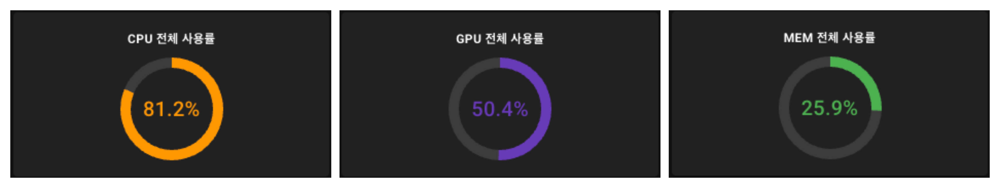
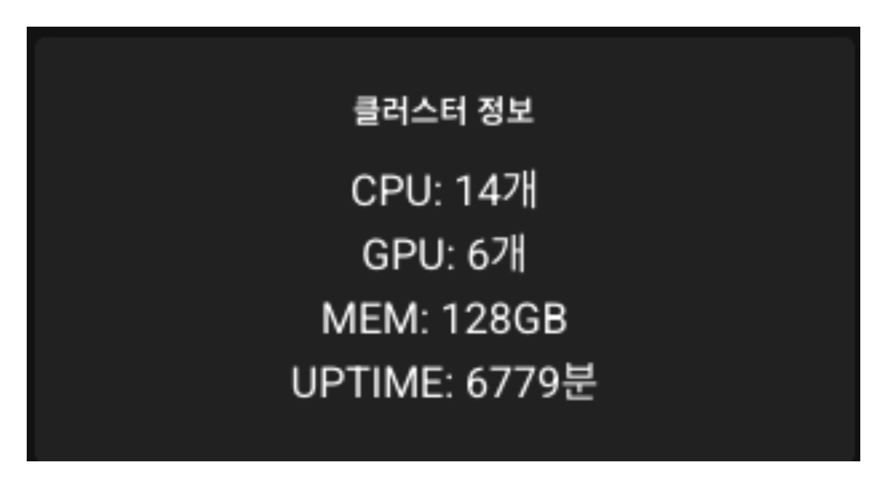
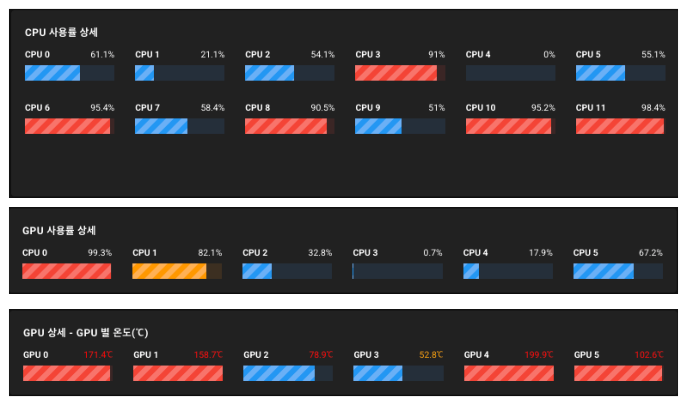
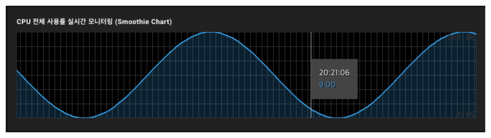
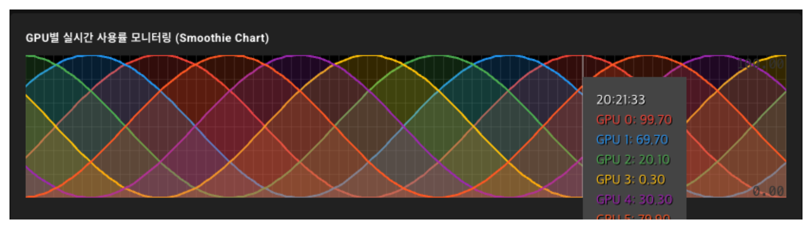
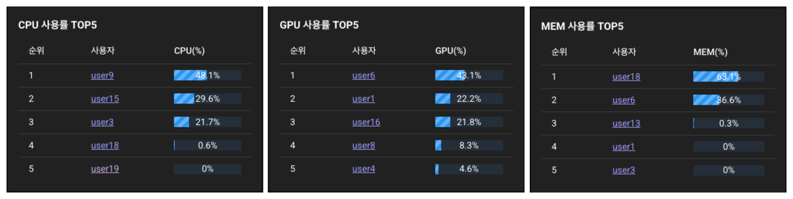
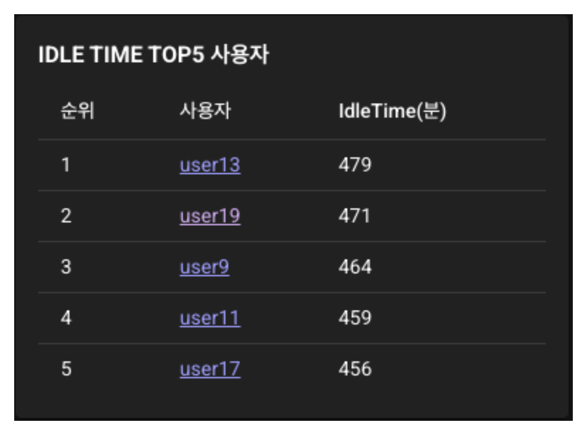

# 3. 대시보드 구성 및 컴포넌트

대시보드의 `XMLHttpRequests` 기반의 실시간 모니터링 기능은 Promise 기반 HTTP 클라이언트 라이브러리 Axios를 이용해 구현되었습니다.

(참고: [Axios]( https://axios-http.com/kr/docs/intro))

## 3.1 관련 파일 구성
```
src
├── components
│   └── dashboard
│       ├── KPI_CPU.vue
│       ├── KPI_GPU.vue
│       ├── KPI_MEM.vue
│       ├── KPI_IDLE.vue
│       ├── KPI_INFO.vue
│       ├── CPU_BARS.vue
│       ├── GPU_BARS.vue
│       ├── GPU_TEMP.vue
│       ├── CPU_CHART.vue
│       ├── GPU_CHART.vue
│       ├── CPU_RANK.vue
│       ├── GPU_RANK.vue
│       ├── MEM_RANK.vue
│       └── IDLE_RANK.vue
└── pages
    └── board.vue
```

## 3.2 `KPI_CPU.vue`, `KPI_GPU.vue`, `KPI_MEM.vue`


### 기능 설명:
- API를 통해 주기적으로 각 자원의 전체 사용률을 받아옵니다.
- 데이터 로딩 중에는 인디케이터(무한 로딩)로 표시합니다.
- 값을 불러오면 원형 프로그레스바에 퍼센트를 표시합니다.
- 사용하는 값에 따라 색상이 변경됩니다(설정 가능): 
    - 90% 이상 : 빨간색 (위험) 
    - 80% 이상 : 주황색 (주의) 

### 주요 데이터 바인딩 
- `const {VARS} = ...` : API(GET) 에서 받아온 데이터(JSON) 저장용
    - `{VARS}` := { `CPU_USAGE` | `GPU_USAGE` | `MEM_USAGE` }
- `const API_INTERVAL = ...` : API 호출 주기(업데이트 주기)
- `const API_URL = ...` : API 호출 URL 주소
- `const DANGER_LEVEL = ...` : 해당 수준을 넘을 경우 인디케이터 색상을 빨간색으로 변경 
- `const WARNING_LEVEL = ...` : 해당 수준을 넘을 경우 인디케이터 색상을 주황색으로 변경 

### JSON 형식 (`CPU_USAGE` | `GPU_USAGE` | `MEM_USAGE` 공통)
```
{ value: 0 }
```

## 3.3 `KPI_IDLE.vue`


### 기능 설명:
- API를 통해 주기적으로 시스템의 전체 IDLE 시간을 받아옵니다.
- 데이터 로딩 중에는 ...으로 표시합니다.
- 값을 불러오면 누적 분을 표시합니다.

### 주요 데이터 바인딩 
- `const IDLETIME = ...` : API(GET) 에서 받아온 누적 IDLE 시간 저장용(JSON)
- `const API_INTERVAL = ...` : API 호출 주기(업데이트 주기)
- `const API_URL = ...` : API 호출 URL 주소

### JSON 형식(`IDLETIME`)
```
{ value: 0 }
```

## 3.4 `KPI_INFO.vue`


### 기능 설명:
- API를 통해 시스템 HW 정보(cpu 개수, gpu 개수, mem 전체 크기) 및 Uptime을 받아옵니다.
- HW 정보는 페이지 로딩시 최초 한 번만 받아옵니다.
- Uptime은 주기적으로 업데이트 됩니다.
- CPU 개수, GPU 개수, 전체 MEM 크기, UPTIME 누적 시간 표시

### 주요 데이터 바인딩 
- `const {VARS} = ...` : API(GET) 에서 받아온 데이터(JSON) 저장용
    - `{VARS}` = { `CPU_COUNT` | `GPU_COUNT` | `TOTAL_MEM` | `UPTIME` }
- `const uptime = ...` : API(GET) 에서 받아온 누적 Uptime 저장용(JSON)
- `const API_INTERVAL = ...` : API 호출 주기(업데이트 주기)
- `const API_URL_... = ...` : API 호출 URL 주소

### JSON 형식 (`CPU_COUNT` | `GPU_COUNT` | `TOTAL_MEM` | `UPTIME` 공통)
```
{ value: 0 }
```

## 3.5 `CPU_BARS.vue`, `GPU_BARS.vue`, `GPU_TEMP.vue`

### 기능 설명:
- API를 통해 주기적으로 각 자원의 개별 사용률(및 온도 값)를 받아옵니다.
- 데이터 로딩 중에는 인디케이터(무한 로딩)로 표시합니다.
- 값을 불러오면 개별 자원 마다 프로그레스바에 퍼센트를 표시합니다.
- 사용하는 값에 따라 색상이 변경됩니다(설정 가능): 
    - 90% 또는 90℃ 이상 : 빨간색 (위험) 
    - 80% 또는 80℃ 이상 : 주황색 (주의) 

### 주요 데이터 바인딩 
- `const {VARS} = ...` : API(GET) 에서 받아온 데이터(JSON) 저장용
    - `{VARS}` = { `CPUS_USAGE` | `GPUS_USAGE` | `GPUS_TEMP` }
- `const API_INTERVAL = ...` : API 호출 주기(업데이트 주기)
- `const API_URL = ...` : API 호출 URL 주소
- `const DANGER_LEVEL = ...` : 해당 수준을 넘을 경우 인디케이터 색상을 빨간색으로 변경 
- `const WARNING_LEVEL = ...` : 해당 수준을 넘을 경우 인디케이터 색상을 주황색으로 변경 

### JSON 형식 (`CPUS_USAGE` | `GPUS_USAGE` | `GPUS_TEMP` 공통)
```
{
    gpus = [
        { id: 0, value: 0 },
        { id: 1, value: 0 },
        { id: 2, value: 0 },
        ...
    ]
}
```
## 3.6 `CPU_CHART.vue`



### 기능 설명:
- API를 통해 주기적으로 CPU의 전체 사용률을 받아옵니다. 
    - `KPI_CPU.vue`와 동일한 API 사용 가능
- 값을 불러오면 `smoothie` 차트를 이용해 시간에 따른 사용률 추이를 모니터링 합니다.
- 마우스 커서를 `hover` 하면 정확한 시간에 따른 사용률 수치 확인 할수 있는 Tooltip이 나타납니다.

### 주요 데이터 바인딩 
- `const smoothieCanvas = ...` : API(GET) 에서 받아온 데이터 시리즈를 이용해 차트를 표시
- `const API_INTERVAL = ...` : API 호출 주기(업데이트 주기)
- `const API_URL = ...` : API 호출 URL 주소

### JSON 형식 ()
```
{ value: 0 }
```

## 3.7 `GPU_CHART.vue`



### 기능 설명:
- API를 통해 주기적으로 GPU의 개별 사용률을 받아옵니다. 
    - `GPU_BARS.vue`와 동일한 API 사용 가능
- 값을 불러오면 `smoothie` 차트를 이용해 시간에 따른 사용률 추이를 모니터링 합니다.
- 마우스 커서를 `hover` 하면 정확한 시간에 따른 개별 사용률 수치를 확인 할수 있는 Tooltip이 나타납니다.

### 주요 데이터 바인딩 
- `const smoothieCanvas = ...` : API(GET) 에서 받아온 데이터 시리즈를 이용해 차트를 표시
- `const API_INTERVAL = ...` : API 호출 주기(업데이트 주기)
- `const API_URL = ...` : API 호출 URL 주소

### JSON 형식
```
{
    gpus = [
        { id: 0, value: 0 },
        { id: 1, value: 0 },
        { id: 2, value: 0 },
        ...
    ]
}
```

## 3.6 `CPU_RANK.vue`, `GPU_RANK.vue`, `MEM_RANK.vue`



### 기능 설명:
- API를 통해 주기적으로 각 자원 사용률이 높은 사용자와 사용률을 Top 5 목록 받아옵니다. 
- 데이터 로딩 중에는 인디케이터(무한 로딩)로 표시합니다.
- 값을 불러오면 각 자원 사용률이 높은 사용자 순위 별로 정렬해여 Top 5 목록을 표시합니다.
- 각 항목에는 사용률을 사긱화하여 프로그레스바로 표시합니다.
- 각 사용자명에는 클릭시 사용자 리포트로 리다이렉션 하는 링크가 달려있습니다.

### 주요 데이터 바인딩 
- `const {VARS} = ...` : API(GET) 에서 받아온 데이터(JSON) 저장용
    - `{VARS}` = { `USERS_CPU` | `USERS_GPU` | `USERS_MEM` }
- `const API_INTERVAL = ...` : API 호출 주기(업데이트 주기)
- `const API_URL = ...` : API 호출 URL 주소

### JSON 형식 (`USERS_CPU` | `USERS_GPU` | `USERS_MEM` 공통)
```
{
    users = [
        { user: "user_0", value: 0 },
        { user: "user_1", value: 0 },
        { user: "user_2", value: 0 },
        ...
    ]
}
```

## 3.7 `IDLE_RANK.vue`

### 기능 설명:
- API를 통해 주기적으로 IDLE 시간이 높은 사용자와 누적 IDLE 시간(분) Top 5 목록 받아옵니다. 
- 데이터 로딩 중에는 인디케이터(무한 로딩)로 표시합니다.
- 값을 불러오면 IDLE 시간이 높은 사용자 순위 별로 정렬해여 Top 5 목록을 표시합니다.
- 각 사용자명에는 클릭시 사용자 리포트로 리다이렉션 하는 링크가 달려있습니다.

### 주요 데이터 바인딩 
- `const USERS_IDLE = ...` : API(GET) 에서 받아온 데이터(JSON) 저장용
- `const API_INTERVAL = ...` : API 호출 주기(업데이트 주기)
- `const API_URL = ...` : API 호출 URL 주소

### JSON 형식 (`USERS_IDLE`)
```
{
    users = [
        { user: "user_0", value: 0 },
        { user: "user_1", value: 0 },
        { user: "user_2", value: 0 },
        ...
    ]
}
```