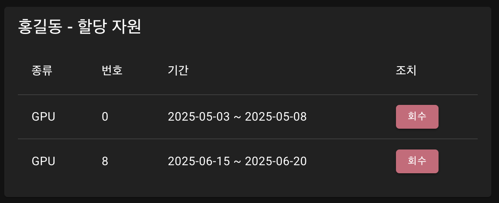
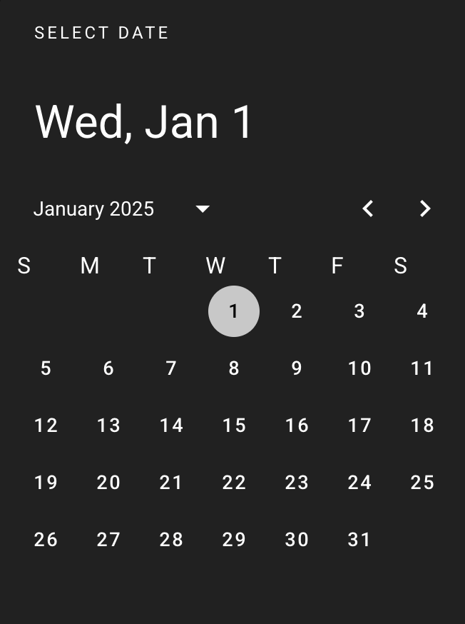

# 5. 자원 관리 페이지 구성 및 컴포넌트

`/resources.vue`는 사용자별 자원 할당/회수 및 필터링을 위한 Vue 기반 대시보드입니다.  
전체 자원 중 어떤 사용자가 GPU/CPU/Memory를 언제부터 언제까지 사용하고 있는지를 시각적으로 표시하며,  
자원 할당 및 회수 기능도 포함됩니다.


## 5.1 관련 파일 구성
```
src
├── components
│ └── resources
│ └── LineChart.vue ← Chart.js 기반 라인 차트
├── pages
│ └── resources.vue ← 자원 할당/회수 + 필터 + 테이블 UI
```

## 5.2 사용자 검색 카드


- 상단 영역에 위치
- 이름 또는 ID를 포함하는 문자열로 실시간 검색 가능
- `v-text-field` 사용, `searchKeyword`로 v-model 바인딩
- `computed`로 필터링된 사용자 목록을 실시간 렌더링

```
```

## 5.3 사용자별 자원 카드



- 각 사용자는 하나의 카드에 표시됨
- 각 자원 종류(GPU, CPU, Memory) 별로 테이블 출력
- 열 구성: 자원 종류, 번호, 기간(시작~종료), 회수 버튼
- `resources.value` 배열에서 사용자의 자원만 필터링

```
```

## 5.4 자원 할당 다이얼로그



- 자원 할당 시 `assignDialog = true` 로 활성화
- 사용자, 자원 종류, 복수 자원 선택, 시작일, 만료일 입력
- 시작/종료일은 Vuetify `<v-date-picker>`로 선택 가능
- 할당 완료 시 `/api/allocations` 에 POST 요청 전송

```
json
POST /api/allocations
{
  "res_id": 0,
  "type": "GPU",
  "user": "홍길동",
  "start_date": "2025-06-01",
  "end_date": "2025-06-07"
}
```